# Sajilo Khata

> A multi-tenant shop management SaaS for small Nepali businesses — manage inventory, sales, credit (Khata), expenses, and get AI-powered business insights, all from one dashboard.

[](https://sajilo-khata.onrender.com)
[](https://railway.app)
[](https://supabase.com)

**Demo credentials**
| Field | Value |
|---|---|
| Email | demo@sajilokhata.com |
| Password | demo1234 |

---

## Why I built this

Most small shops in Nepal still track credit and sales in paper notebooks. I wanted to build something that replaces that — a simple but complete system a shop owner could actually use daily. It also gave me a real project to practice building a production-ready NestJS backend with multi-tenancy, guards, payment integration, and PDF generation.

---

## Highlights

- Multi-tenant SaaS architecture
- JWT authentication & subscription guards
- Inventory & stock management
- Sales, purchases & customer credit (Khata)
- Khalti payment integration
- AI-powered business assistant
- PDF invoice generation with Puppeteer

## Screenshots

### Landing Page

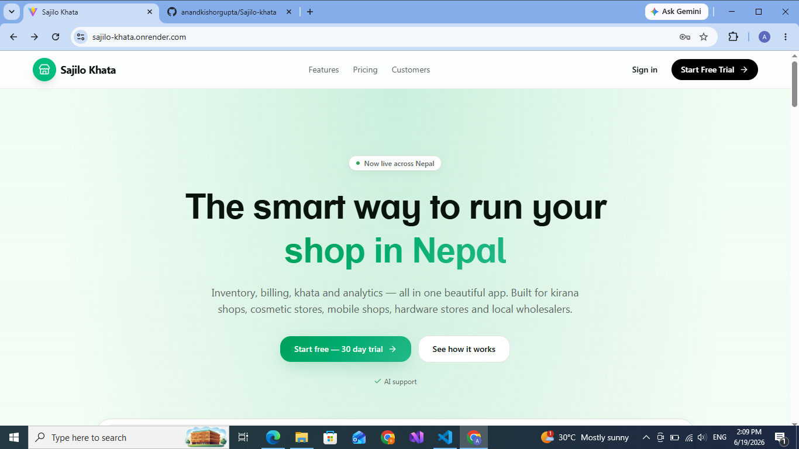

---

### Authentication

| Login                                | Register                                   |
| ------------------------------------ | ------------------------------------------ |
| 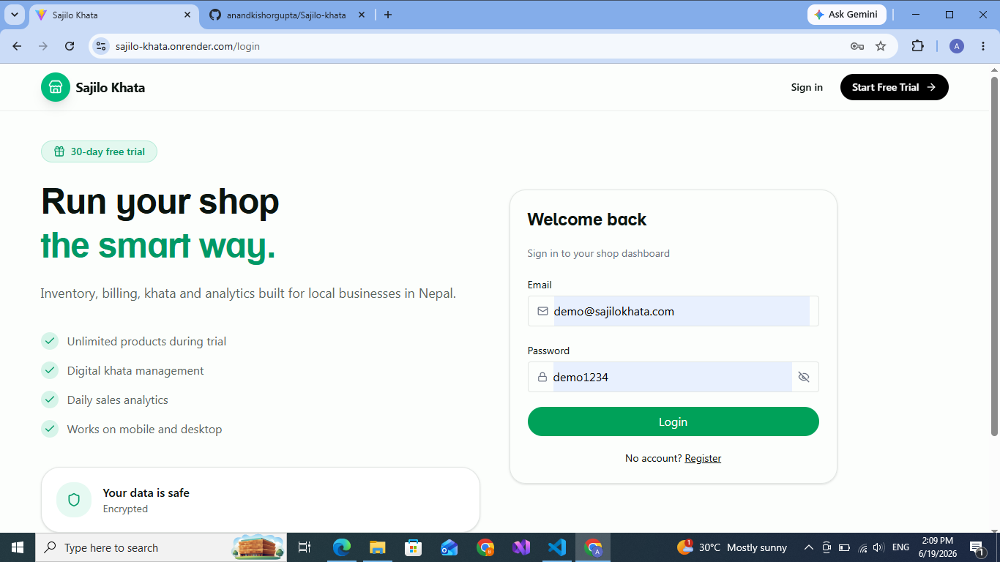 | 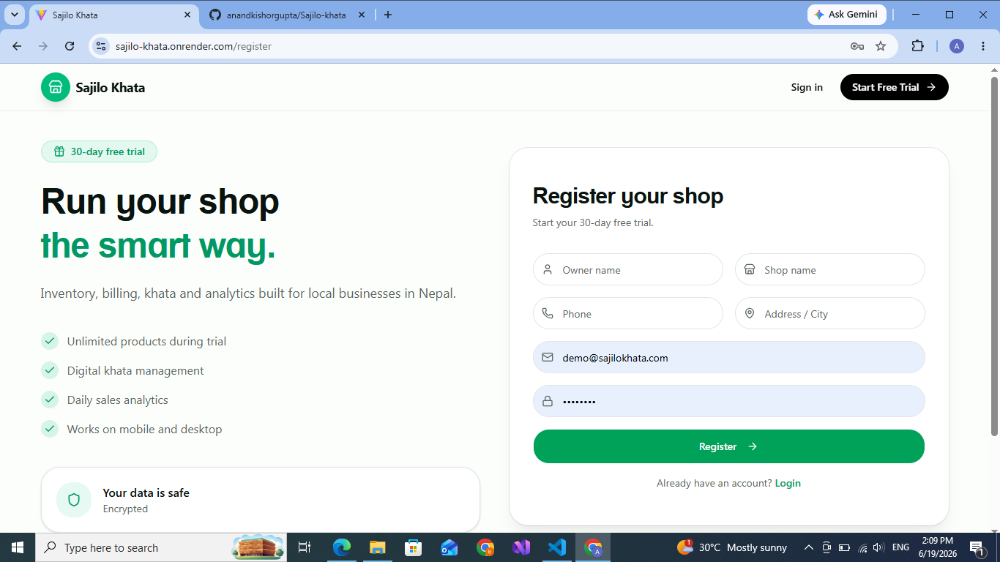 |

---

### Dashboard

| Main Dashboard                               | Alternative Dashboard View                      |
| -------------------------------------------- | ----------------------------------------------- |
| 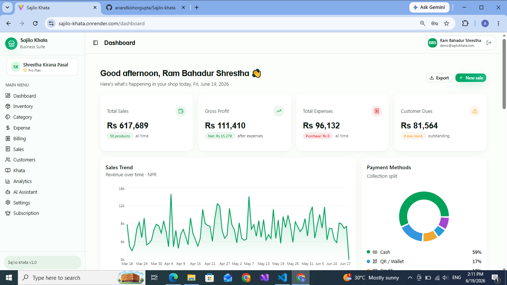 | 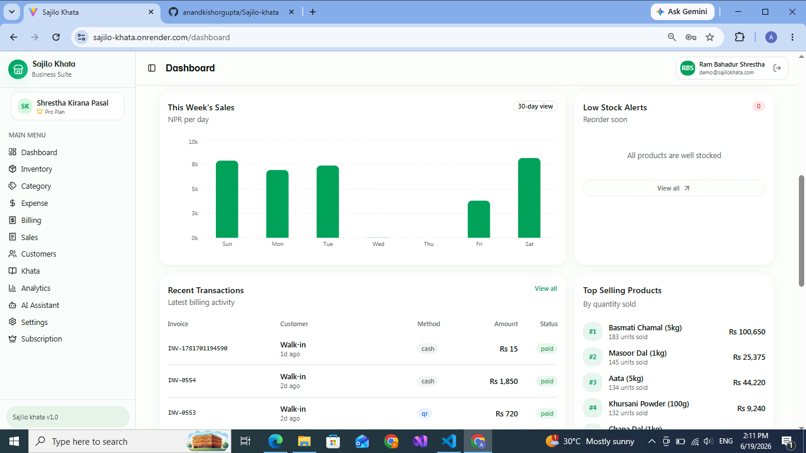 |

---

### Inventory & Categories

| Inventory                                    | Categories                                     |
| -------------------------------------------- | ---------------------------------------------- |
| 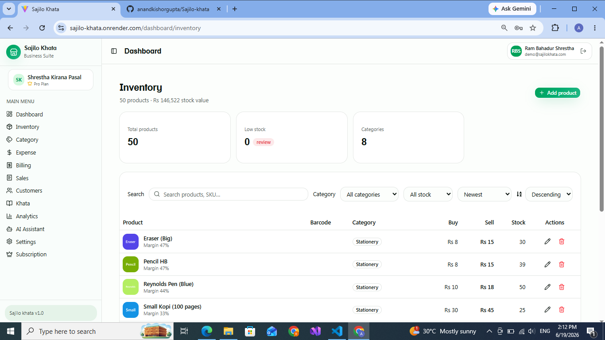 | 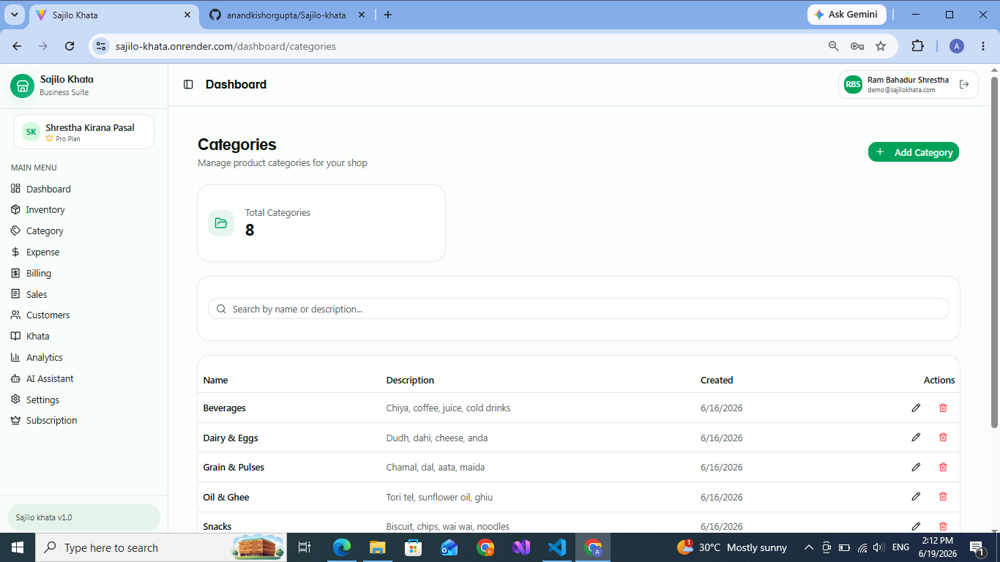 |

---

### Sales & Billing

| Billing                                  | Sales                                |
| ---------------------------------------- | ------------------------------------ |
| 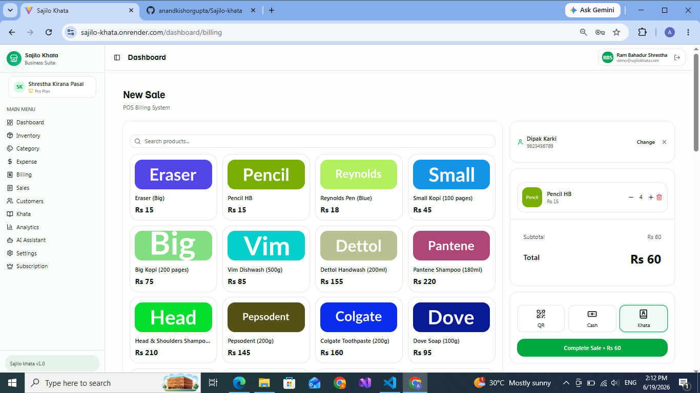 | 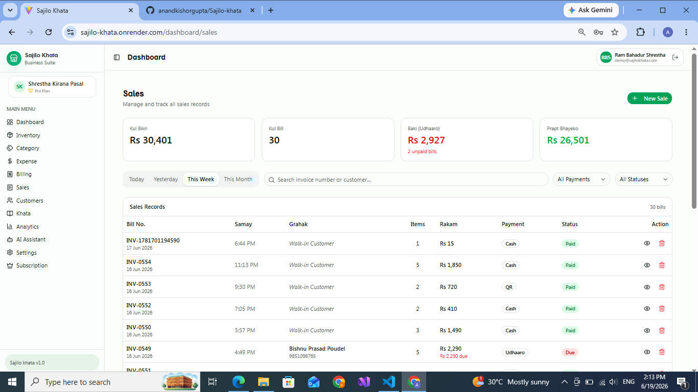 |

---

### Customer & Khata Management

| Customers                                    | Khata                                |
| -------------------------------------------- | ------------------------------------ |
| 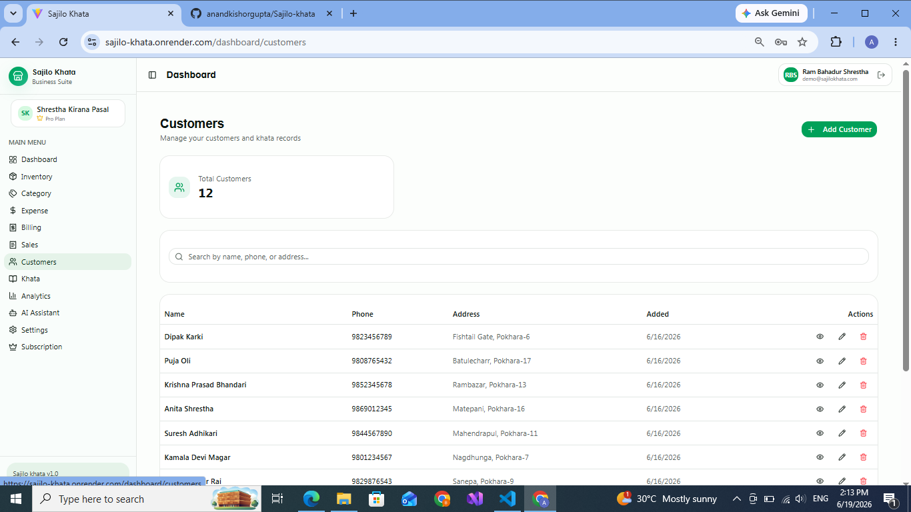 | 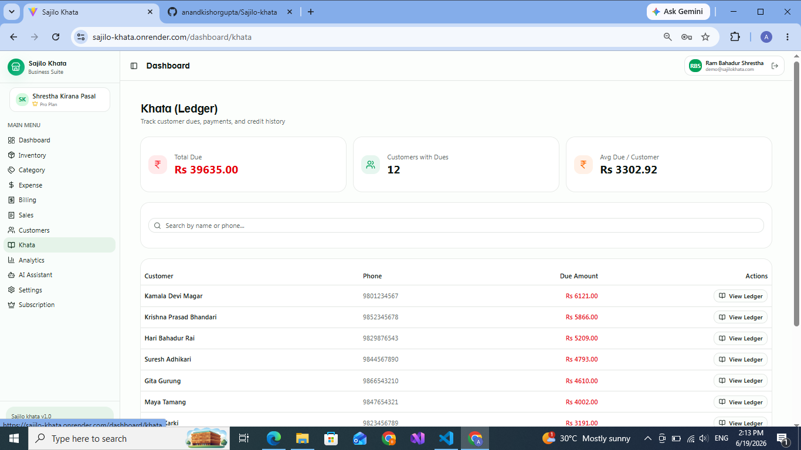 |

---

### Business Operations

| Expenses                                  | Analytics                                    |
| ----------------------------------------- | -------------------------------------------- |
| 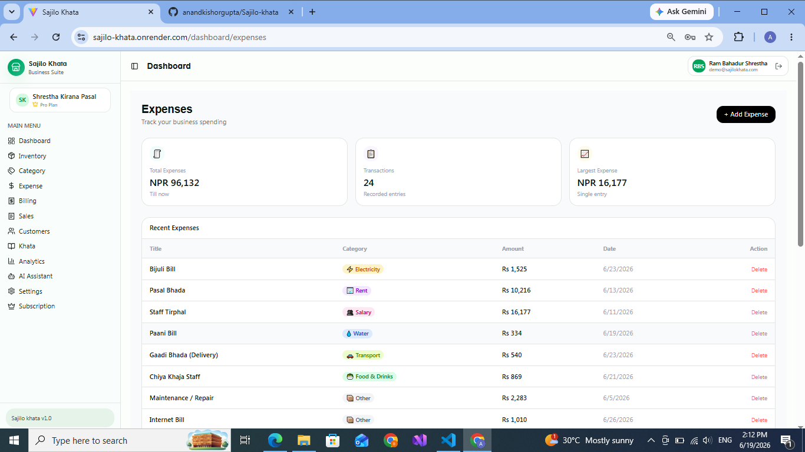 | 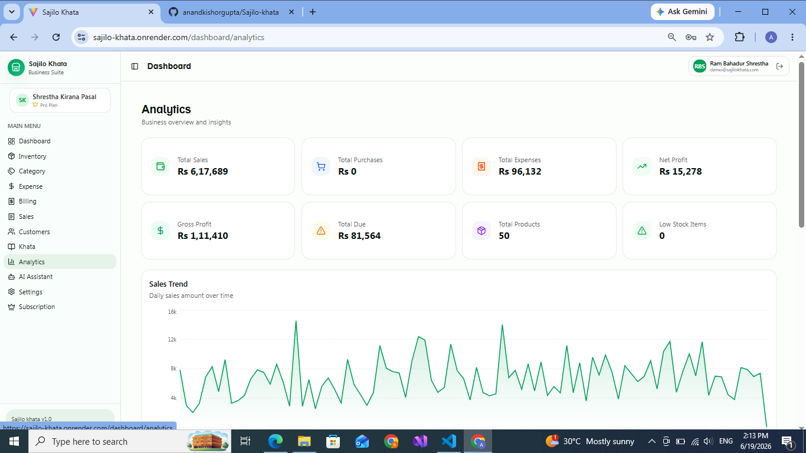 |

---

### AI Assistant

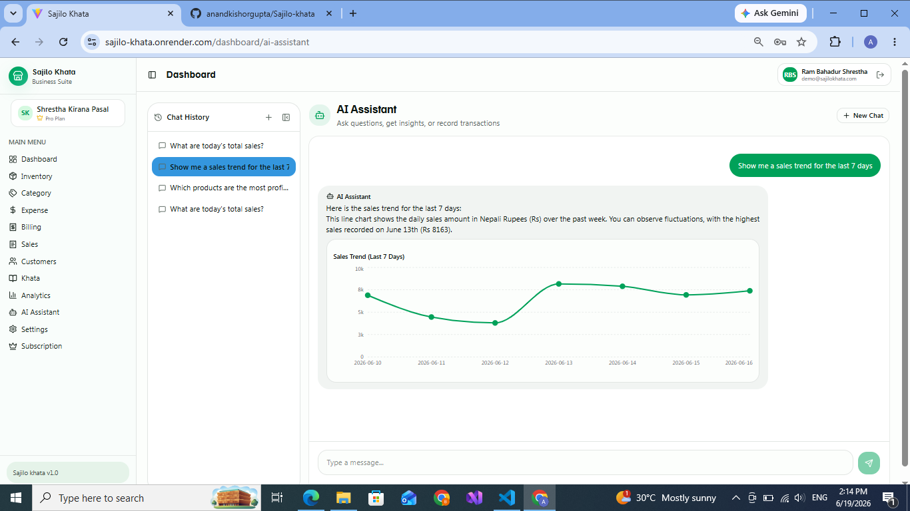

---

### Subscription & Payments

| Subscription                                       | Khalti Payment                         |
| -------------------------------------------------- | -------------------------------------- |
| 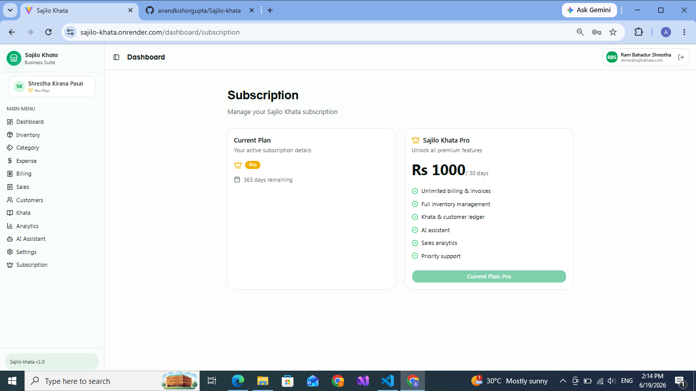 | 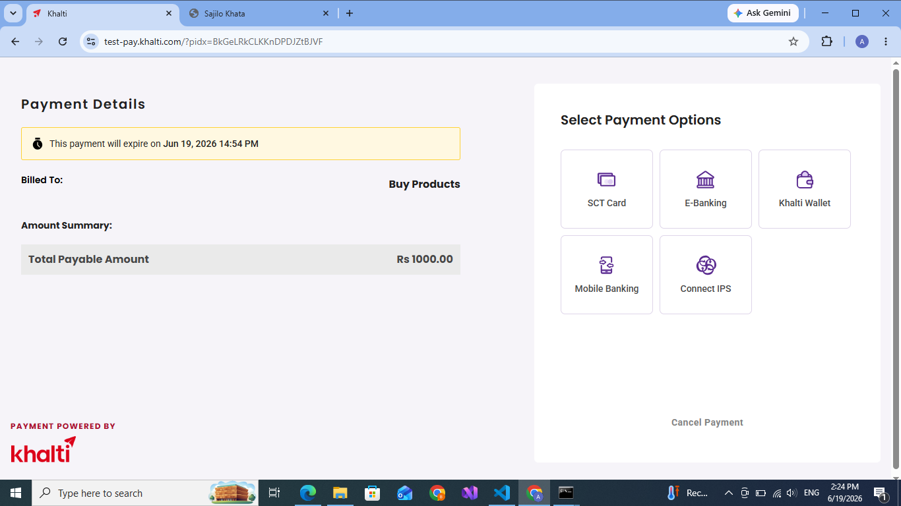 |

## Features

| Area               | What it does                                                                    |
| ------------------ | ------------------------------------------------------------------------------- |
| **Inventory**      | Add products with barcode, category, purchase/selling price, low stock alerts   |
| **Sales & POS**    | Billing with discount, tax, multiple payment methods, PDF invoice via Puppeteer |
| **Purchases**      | Record supplier purchases, auto-update stock, track due payments                |
| **Customer Khata** | Credit sales, payment collection, live outstanding balance per customer         |
| **Expenses**       | Daily expense recording with categories                                         |
| **Subscription**   | Trial/Pro plans enforced via global guard, Khalti payment integration           |
| **AI Assistant**   | Ask natural language questions about your sales and inventory (DeepSeek API)    |

---

## Tech Stack

### Frontend

- **React** + **TypeScript** (Vite)
- **Tailwind CSS** + **Shadcn UI**
- **TanStack Query** — server state & caching
- **Redux Toolkit** — client state
- **Axios** with JWT interceptor + 401 auto-redirect

### Backend

- **NestJS** + **TypeScript**
- **TypeORM** + **PostgreSQL**
- **JWT Authentication**
- Global `JwtAuthGuard` + `SubscriptionGuard` with `@Public()` / `@SkipSubscription()` decorators
- **Puppeteer** — HTML-to-PDF invoice generation
- **ImageKit** — product image upload & management

### Infrastructure

| Layer    | Service               |
| -------- | --------------------- |
| Frontend | Render                |
| Backend  | Railway               |
| Database | Supabase (PostgreSQL) |
| Payments | Khalti                |
| AI       | DeepSeek API          |

---

## Architecture

> 3-tier architecture — presentation, application, and data layers deployed independently.

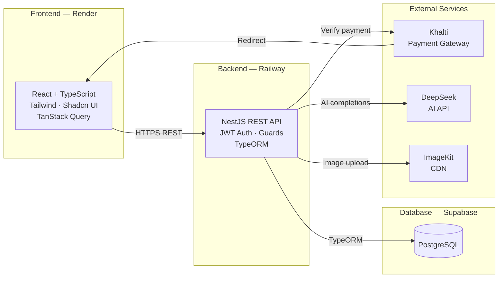
```mermaid
graph LR
    subgraph Frontend["Frontend — Render"]
        FE["React + TypeScript\nTailwind · Shadcn UI\nTanStack Query"]
    end

    subgraph Backend["Backend — Railway"]
        API["NestJS REST API\nJWT Auth · Guards\nTypeORM"]
    end

    subgraph Database["Database — Supabase"]
        DB[("PostgreSQL")]
    end

    subgraph External["External Services"]
        KHALTI["Khalti\nPayment Gateway"]
        DEEPSEEK["DeepSeek\nAI API"]
        IMAGEKIT["ImageKit\nCDN"]
    end

    FE -->|"HTTPS REST"| API
    API -->|"TypeORM"| DB
    API -->|"Verify payment"| KHALTI
    API -->|"AI completions"| DEEPSEEK
    API -->|"Image upload"| IMAGEKIT
    KHALTI -->|"Redirect"| FE
```

---

## Key Implementation Details

A few things I'm particularly happy with in this project:

- **Global subscription enforcement** — a `SubscriptionGuard` wraps every route. Trial shops hit a paywall after expiry without touching individual controllers, using a `@SkipSubscription()` decorator for public routes like the payment verify page.
- **Khalti integration end-to-end** — initiate → verify → activate plan, with a `payments` table tracking `pidx`, `status`, and `transactionId`.
- **Puppeteer PDF invoices** — replaced an initial PDFKit approach with a Puppeteer HTML-to-PDF pipeline for much richer invoice layouts.
- **AI business assistant** — shop owners can ask things like _"which product sold the most this week?"_ and get a natural language answer backed by real shop data passed as context.
- **Multi-tenancy** — every table has a `shop_id` foreign key. Guards extract the shop from the JWT and scope all queries automatically.

---

## Backend Modules

`Auth` · `Shops` · `Products` · `Categories` · `Customers` · `Sales` · `Purchases` · `Expenses` · `Khata Transactions` · `Stock Movements` · `Payments` · `AI Conversations`

---

## Workflows

**Sale flow**

```
Create Sale → Add Sale Items → Deduct Stock → Generate PDF Invoice
                    ↓
          (if credit) → Create Khata Transaction
```

**Purchase flow**

```
Create Purchase → Add Purchase Items → Increase Product Stock
```

**Subscription flow**

```
Initiate Khalti Payment → Redirect to Verify Page → Verify with Khalti API → Activate Pro Plan
```

**Khata flow**

```
Credit Sale → Khata Transaction (credit) → Customer Pays → Khata Transaction (payment) → Balance clears
```

---

## Database Schema

Split into three domain clusters for readability.

### Core — Users, Shop & Inventory

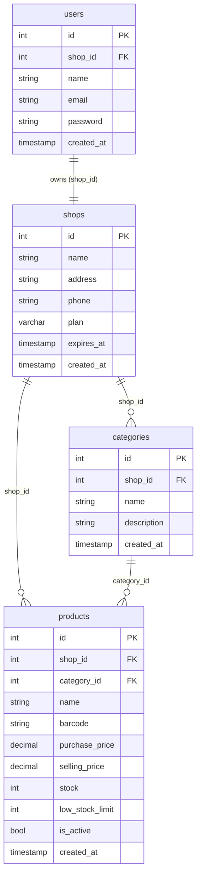
```mermaid
erDiagram
  users ||--|| shops : "owns (shop_id)"
  shops ||--o{ products : "shop_id"
  shops ||--o{ categories : "shop_id"
  categories ||--o{ products : "category_id"

  users {
    int id PK
    int shop_id FK
    string name
    string email
    string password
    timestamp created_at
  }
  shops {
    int id PK
    string name
    string address
    string phone
    varchar plan
    timestamp expires_at
    timestamp created_at
  }
  categories {
    int id PK
    int shop_id FK
    string name
    string description
    timestamp created_at
  }
  products {
    int id PK
    int shop_id FK
    int category_id FK
    string name
    string barcode
    decimal purchase_price
    decimal selling_price
    int stock
    int low_stock_limit
    bool is_active
    timestamp created_at
  }
```

### Transactions — Sales, Purchases & Khata

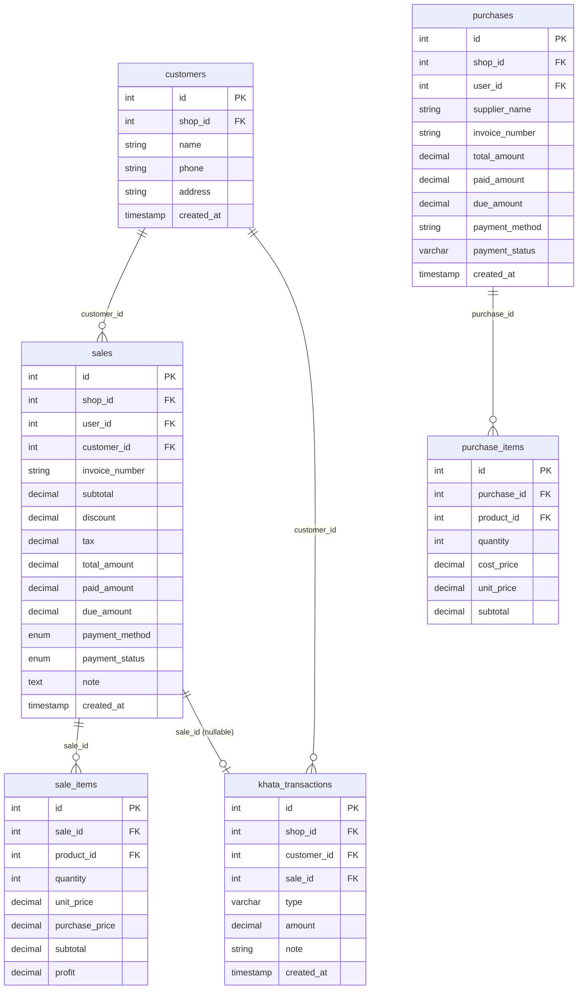
```mermaid
erDiagram
  customers ||--o{ sales : "customer_id"
  customers ||--o{ khata_transactions : "customer_id"
  sales ||--o{ sale_items : "sale_id"
  sales ||--o| khata_transactions : "sale_id (nullable)"
  purchases ||--o{ purchase_items : "purchase_id"

  customers {
    int id PK
    int shop_id FK
    string name
    string phone
    string address
    timestamp created_at
  }
  sales {
    int id PK
    int shop_id FK
    int user_id FK
    int customer_id FK
    string invoice_number
    decimal subtotal
    decimal discount
    decimal tax
    decimal total_amount
    decimal paid_amount
    decimal due_amount
    enum payment_method
    enum payment_status
    text note
    timestamp created_at
  }
  sale_items {
    int id PK
    int sale_id FK
    int product_id FK
    int quantity
    decimal unit_price
    decimal purchase_price
    decimal subtotal
    decimal profit
  }
  purchases {
    int id PK
    int shop_id FK
    int user_id FK
    string supplier_name
    string invoice_number
    decimal total_amount
    decimal paid_amount
    decimal due_amount
    string payment_method
    varchar payment_status
    timestamp created_at
  }
  purchase_items {
    int id PK
    int purchase_id FK
    int product_id FK
    int quantity
    decimal cost_price
    decimal unit_price
    decimal subtotal
  }
  khata_transactions {
    int id PK
    int shop_id FK
    int customer_id FK
    int sale_id FK
    varchar type
    decimal amount
    string note
    timestamp created_at
  }
```

### Operations — Expenses, Stock, Payments & AI

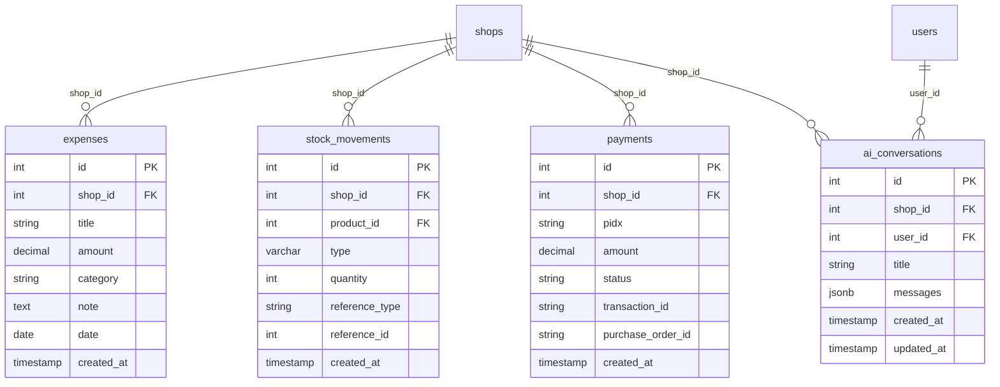
```mermaid
erDiagram
  shops ||--o{ expenses : "shop_id"
  shops ||--o{ stock_movements : "shop_id"
  shops ||--o{ payments : "shop_id"
  shops ||--o{ ai_conversations : "shop_id"
  users ||--o{ ai_conversations : "user_id"

  expenses {
    int id PK
    int shop_id FK
    string title
    decimal amount
    string category
    text note
    date date
    timestamp created_at
  }
  stock_movements {
    int id PK
    int shop_id FK
    int product_id FK
    varchar type
    int quantity
    string reference_type
    int reference_id
    timestamp created_at
  }
  payments {
    int id PK
    int shop_id FK
    string pidx
    decimal amount
    string status
    string transaction_id
    string purchase_order_id
    timestamp created_at
  }
  ai_conversations {
    int id PK
    int shop_id FK
    int user_id FK
    string title
    jsonb messages
    timestamp created_at
    timestamp updated_at
  }
```

---

## Getting Started

### Prerequisites

- Node.js 18+
- PostgreSQL
- Khalti test credentials
- DeepSeek API key

### Backend

```bash
git clone https://github.com/anandkishorgupta/Sajilo-khata
cd sajilokhata-api
pnpm install
cp .env   # fill in your DB, JWT, Khalti, DeepSeek keys
pnpm run start:dev
```

### Frontend

```bash
git clone https://github.com/anandkishorgupta/Sajilo-khata
cd client
pnpm install
cp .env   # set VITE_API_URL
pnpm run dev
```

---

## What I'd improve next

- Multi-user support per shop (roles: owner, staff)
- SMS reminders for overdue Khata balances
- Advanced sales analytics dashboard
- Supplier management module
